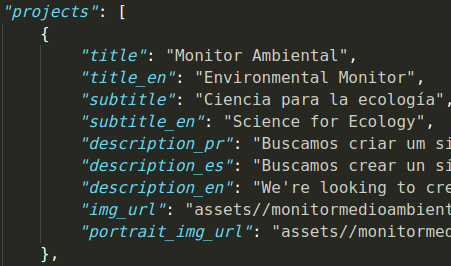

# ReGOSH Landing (0.9.0)

Este repositorio contiene el codigo fuente del landing page de la residencia GOSH.

## TODO: Completar datos
Luego de haber finalizado con el diseno e interacciones, se requiere un paso mas que es completar con los datos correspondientes a la primera residencia (Proyectos, Informacion de contacto de las personas que participaron en la primera residencia) y con la definicion de la misma (Explicar que es GOSH). Para lograr esto prepare una documentacion a manera de explicar como actualizar esta informacion.

## Documentacion

El codigo del landing se diseno de tal manera que sea *parametrico*, toda la informacion del landing es centralizado por un archivo JSON (data.json), es decir que al editar este archivo con nueva informacion, la pagina leera esta nueva version y mostrara la info actualizada.

Para editar el archivo JSON podemos usar cualquier editor de codigo ([Sublime Text](https://www.sublimetext.com/), [Atom](https://atom.io/), [Visual Studio Code](https://code.visualstudio.com/). Tambien podemos usar este editor online de [JSON](https://jsonformatter.org/json-editor).

La estructura de los datos en data.json es la siguiente:

Se organizo por secciones:
- La seccion *landing* contiene textos y titulos estaticos de la pagina.
- La seccion *projects* contiene la lista de proyectos realizados.
- La seccion *residences* contiene la relacion de participantes por residencia
- *shares* contiene los enlaces en las resdes sociales que tiene reGosh y tecnologias libres.

### Landing
        TODO
### Proyectos
Dentro del campo de proyectos que es un *[array](https://www.w3schools.com/js/js_json_arrays.asp)* o lista de proyectos (dentro del `{}`) se define con la siguiente estructura

Cada proyecto contempla los siguientes datos `title`, `subtitle`, `description`, `img_url` y `portrait_img_url`. `img_url` es el link de una imagen representativa pequena cuadrada del proyecto. `portrait_img_url` se refiere a una imagen de portada (por defecto larga y rectangular) del proyecto y es la que se muestra cuando se expande los detalles del proyectos en el landing.

#### Internacionalizacion

Algunos campos de textos, tipicamente los de *title*, o *description* tienen el detalle de presentarse en multiples idiomas (por ahora esta soportado Espanol, Portugues e Ingles). Para esto, solo se agrega un campo adicional con el mismo nombre del campo y con el sufijo `_en`, `_es` o `_pr` para definir el texto en ese idioma. De igual manera esto aplica para los otros campos

### Residencias
El campo de residencias tiene la siguiente estructura

Dentro del campo "members" es donde se define la informacion de cada miembro, pongo como ejemplo la siguiente estructura de informacion que se podria seguir. En caso no tener o no compartir alguna informacion se puede omitir para el caso de `contact_list` (dejar vacio el array: `[]`), los demas campos son obligatorios.

### Shares
        TODO
    

## License

This project is licensed under the MIT License - see the [LICENSE.md](LICENSE.md) file for details
